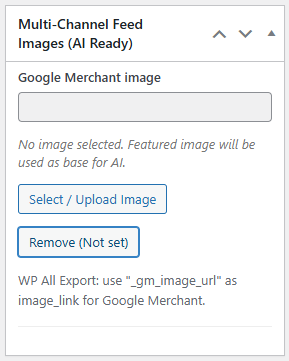
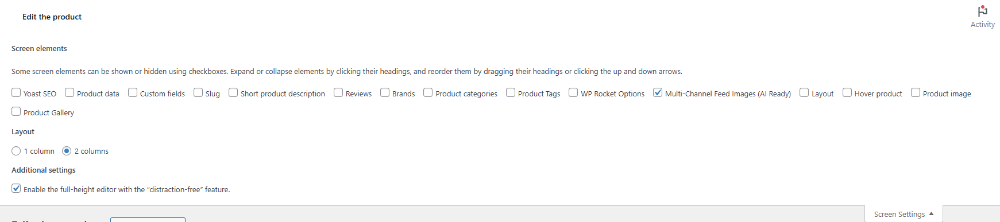
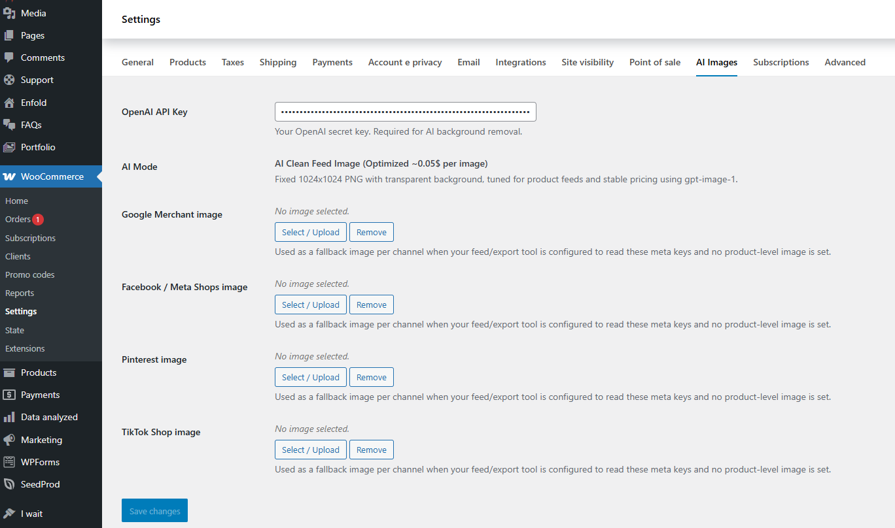
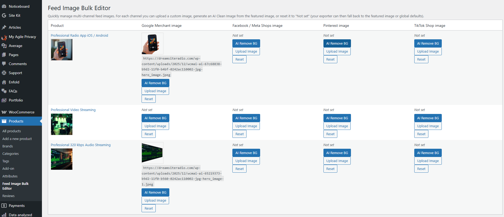
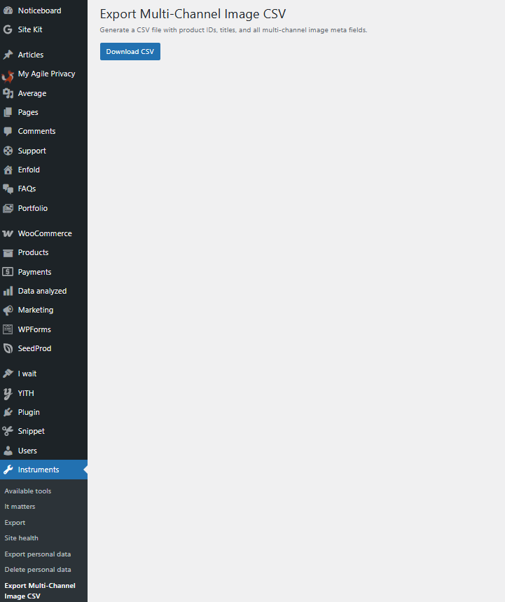
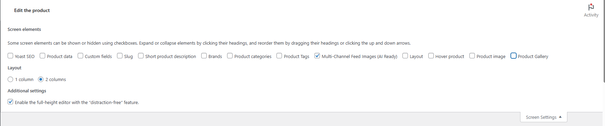
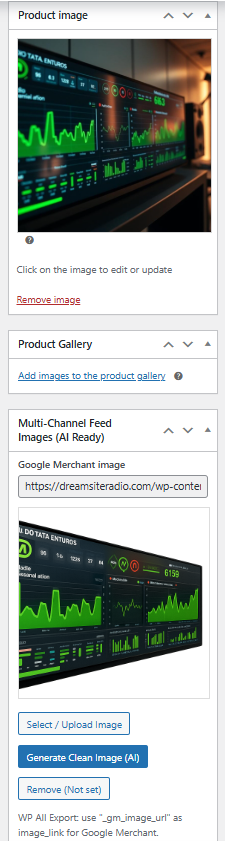
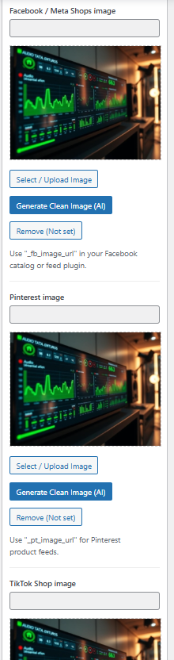

# Clean Image for Google Merchant (WC)

**Contributors:** merchantpure  
**Tags:** woocommerce, google merchant, feed image, product image, ai  
**Requires at least:** WordPress 5.0  
**Tested up to:** WordPress 6.9  
**Requires PHP:** 7.4  
**Stable tag:** 1.3.1  
**License:** GPLv2 or later  
**License URI:** https://www.gnu.org/licenses/gpl-2.0.html  

Adds a dedicated, policy-compliant product image field to WooCommerce products, designed for Google Merchant Center feeds.

---

## Description

If you are using WooCommerce and your website displays promotional product images — banners, text overlays, badges, stickers — your feed for **Google Merchant Center**, **Facebook / Meta Shops**, **Pinterest**, or **TikTok Shop** can be rejected instantly.

Google strictly requires **clean, neutral, non-promotional main images**.  
But merchants often refuse to give up their beautiful promotional product graphics used on the website.

**Clean Image for Google Merchant (WC) solves this problem elegantly.**  
You can keep using promotional images on your website while assigning *clean and policy-safe images* exclusively to product feeds.

The free version allows you to upload separate feed images for Google.  
The **PRO version** adds full AI automation and multi-channel feed image management.

---

## Why this plugin exists

Merchants often say:

- “My feed keeps getting rejected because product images have text.”
- “Google doesn’t want promotional overlays but I can’t remove them from my website.”
- “I sell more with promotional images but Google Merchant blocks my products.”

Now you don’t have to choose.

Your website keeps its marketing visuals.  
Your feeds stay compliant and approved.

---

## Real-world results

In real-world usage, this plugin has helped WooCommerce merchants:

- Restore fully disapproved Google Merchant feeds in a few days
- Keep promotional images on their storefront
- Resume Google Ads campaigns
- Recover lost traffic and orders without rebuilding product images

This plugin was built to solve a **real recurring problem**, not a theoretical one.

---

## Key Features

### ✅ Free Version

- Dedicated feed image for **Google Merchant Center**
- Website promotional images remain untouched
- Fully policy-compliant feeds
- Compatible with any WooCommerce store
- Lightweight and fast

---

### ⭐ PRO Version (Upgrade Recommended)

Includes all free features **plus**:

#### AI Clean Feed Image Generator
Generates **1024×1024 transparent PNG** images optimized for product feeds.  
Removes backgrounds, text overlays, banners and promotional elements.

#### OpenAI API Key Integration
Generate clean images directly inside WooCommerce.

#### Global Default Images (Per Channel)
Fallback images for Google, Facebook, Pinterest and TikTok.

#### Feed Image Bulk Editor
Bulk upload, generate, reset and manage feed images for all products.

#### Multi-Channel CSV Export
Export product IDs, titles and all feed image meta fields.

#### Screen Options Integration
Enable or disable PRO metaboxes using native WordPress Screen Options.

#### In-Product AI Button
One-click **Generate Clean Image (AI)** directly inside the product edit page.

#### Additional Channel Metaboxes
Separate feed images for:
- Facebook / Meta
- Pinterest
- TikTok

**Upgrade to PRO:**  
👉 https://davidepuzzo.cloud/6k6o9

---

## Installation

1. Upload the plugin ZIP via **Plugins → Add New → Upload Plugin**
2. Install and activate
3. Ensure WooCommerce is installed and active
4. Edit any product
5. Use the **Google Merchant – Clean Image** metabox to assign a feed-safe image

---

## Screenshots

### 1. Google Merchant Center feed image metabox

### 2. WooCommerce Screen Options panel

### 3. OpenAI API key & global default images (PRO)

### 4. Feed Image Bulk Editor (PRO)

### 5. Export Multi-Channel Image CSV (PRO)

### 6. Screen Options showing PRO metabox toggles (PRO)

### 7. Generate Clean Image (AI) button (PRO)

### 8. Facebook, Pinterest, TikTok feed image metaboxes (PRO)

---

## Frequently Asked Questions

### Does this plugin require WooCommerce?
Yes. This plugin is built specifically for WooCommerce and requires WooCommerce to be installed and active in order to work.

It integrates directly with WooCommerce products and product data to manage separate feed images without modifying your original product images.

---

### Which WooCommerce versions is this plugin compatible with?
This plugin is built specifically for WooCommerce and is regularly tested with the latest stable WooCommerce releases.

At the time of the latest update, the plugin has been tested up to **WooCommerce 10.4.x**, including the most recent patch releases.  
As with any WooCommerce extension, keeping WooCommerce up to date is recommended for the best compatibility.

---

### What is a "clean" image for Google Merchant?
A clean image is a product picture without logos, watermarks, discount badges, promotional text or any overlays that violate Google Merchant Center image policies.

---

### Why should I use WooCommerce Google Merchant Clean Image?
Because many stores want promotional images on their website, but Google Merchant requires neutral and compliant images.

This plugin lets you keep both: promotional images on your storefront and clean images for Google Merchant Center feeds.

---

### Does the plugin modify or overwrite my original product images?
No. The plugin does not edit, crop or clean your images.

It only stores an additional reference (ID + URL) to a separate "clean" image you choose or upload.

---

### Why do I need separate feed images?
Because platforms like Google Merchant reject images with overlays, text, watermarks, or promotional elements.

---

### What happens if I do not set a clean image for a product?
If you do not set a clean image manually, the plugin falls back to the product featured image.

You should still provide a true clean image to be fully compliant.

---

### Which meta keys are used by the base plugin?
Base plugin meta keys:

- `_gm_image_id`
- `_gm_image_url`

---

### Is the plugin compatible with WP All Export / WP All Import?
Yes. The clean image URL is stored as post meta and can be exported or imported using WP All Export / WP All Import.

---

### Does it work with CTX Feed, Product Feed PRO and other feed managers?
Yes. Any feed manager that supports custom meta fields can use the `_gm_image_url` field.

---

### Can I bulk-edit clean images?
Yes, using WP All Import, WP All Export and many others or custom scripts that update the meta keys.

---

### Does the plugin affect the frontend of my store?
No. It only affects admin data and feed/export information, not the product display.

---

### What does the PRO version add?
WooCommerce Clean Image PRO adds dedicated clean image fields for:

- Meta / Facebook & Instagram Shops
- Pinterest Catalog
- TikTok Shop
- AI Clean Feed Image Generator
- OpenAI API Key Integration
- Global Default Images (Per Channel)
- Feed Image Bulk Editor
- Export Multi-Channel Image CSV
- AI Clean Image Button Inside Product Page

Each platform has its own ID + URL meta keys and CSV export columns.

---

### Which meta keys does the PRO version use?
PRO meta keys:

- **Meta / Facebook:** `_gm_image_id_meta` / `_gm_image_url_meta`
- **Pinterest:** `_gm_image_id_pinterest` / `_gm_image_url_pinterest`
- **TikTok:** `_gm_image_id_tiktok` / `_gm_image_url_tiktok`

---

### Can I add my own custom channels in the PRO version?
Yes. Developers can use the `wc_gm_image_pro_channels` filter to add or modify channels and meta keys.

---

### Are AI / automatic image cleaning features included?
Not in this FREE release.

All images must be selected manually.  
AI / automatic image cleaning features are included in the PRO release.

---

### Does the PRO version require an OpenAI API Key?
Yes, only for AI-generated clean images.

---

### I don’t want to pay for AI. Will the plugin still work?
Absolutely yes.

Using AI is completely optional. The plugin works perfectly even if you never use AI features or never spend a single cent on AI.

AI background removal is simply an extra tool to speed things up, but you are never forced to use it.

You can always manually upload clean, feed-safe images that are different from your main WooCommerce product image.

Thanks to this plugin, you can manage separate images for Google Merchant, Facebook, Pinterest, and TikTok feeds — something that is not possible with standard WooCommerce alone.

AI just makes the process faster, but manual image control works exactly the same.

---

### How much will the AI cost me?
AI processing is extremely affordable.

The cost is based **only on the image that OpenAI generates** (a clean 1024×1024 image), not on the size of your original upload.

Whether your product image is 500 KB or 18 MB, the AI generation cost stays almost the same.

On average, a clean feed-ready image costs between **$0.02 and $0.06 per image**, depending on the OpenAI model used at the time.

---

### I’ve heard about OpenAI, but I don’t know where to get my API Key
You can create an OpenAI account here:  
https://openai.com

If you already have an account, log in here:  
https://platform.openai.com/login

Once logged in, generate your API key on this page:  
https://platform.openai.com/api-keys

---

### Can I export or migrate my multi-channel images?
Yes — with the PRO CSV export tool.

---

### Does this plugin improve SEO?
Indirectly yes, because approved product listings increase your visibility on merchant platforms.

---

### What happens if I deactivate the plugin?
The stored meta data remains in the database.

Feeds may stop reading those fields, but nothing is deleted.

---

### What are the minimum requirements?
- WordPress 5.0+
- WooCommerce 5.0+
- PHP 7.2+

---

## AI Pricing Explained

This plugin uses your own OpenAI API Key for AI-powered image processing.

The cost depends only on the image that OpenAI generates (the clean 1024×1024 output), not on your original file size.

This means:
- A 500 KB image costs the same as an 18 MB image
- You only pay for the final AI-generated image
- Background removal and feed-safe image generation are extremely affordable

Typical cost per image:  
**$0.02 to $0.06 per AI-generated image**

Your usage depends on:
- How many products you process
- How often you regenerate clean images
- The OpenAI model used at that moment

This makes AI background removal a cost-effective solution even for large catalogs.

---

## Changelog

### 1.3.1
- Stable version

### 1.3
- Bug fix

### 1.2.3
- Added PRO version notice
- Improved Google Merchant compliance guidance
- Bug fix

### 1.2.2
- Restored original metabox logic
- Fixed missing metabox edge cases
- English localization

### 1.2.1
- Improved JS/CSS loading
- Added WooCommerce dependency declaration

### 1.2.0
- Initial release

## WordPress.org
Plugin page:  
https://wordpress.org/plugins/clean-image-for-google-merchant-wc/

## Author
MerchantPure

## License
GPL v2 or later
